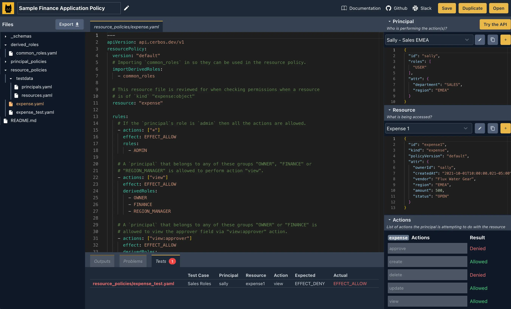

# Cerbos: Fine-Grained Access Control in Days NOT Months

Recently I came across a new open-source project called `Cerbos: Authorization-as-a-Service`. It worth to discuss it here.

## So... What is Cerbos?

*In a very brief:* 

[Cerbos](https://www.cerbos.dev/) is an authorization solution, which helps developers easily implement and manage fine-grained access control. 
As of November 2024, Cerbos is still in the early stages of development, but it already looks promising.

They offer two main products such as [Cerbos Hub](https://www.cerbos.dev/product-cerbos-hub) and [Cerbos Policy Decision Point (PDP)](https://www.cerbos.dev/product-cerbos-pdp).
It's kinda one solution for different teams like [Developers](https://www.cerbos.dev/for-developers), [Architects](https://www.cerbos.dev/for-architects), [Security Engineers](https://www.cerbos.dev/for-security-teams), and [Product Teams](https://www.cerbos.dev/for-product-teams) to implement authorization in their applications.

Let's dive into the details. And see how different teams can benefit from Cerbos.

## Cerbos Hub: 

### Cerbos for Developers: Why Developers Love Cerbos?

Authorization can be a complex, time-consuming task for developers. But with **Cerbos**, you can simplify your workflow and focus on building amazing features instead of wrestling with access controls.  

#### **Implement Authorization Once**  

Want to see how easy it is? Check out the [Cerbos video tutorial](https://youtu.be/caqUh6i3vVQ) to learn how to add a typical `CRUD policy` to a simple Express app in Node.

#### **Developer-Centric Design**  
Cerbos is built by developers, for developers. It's designed to seamlessly integrate with your existing infrastructure, no matter how you deploy:  
- Host it as a **`sidecar`**, **`service`**, or **`function`**.  
- Define permissions as **`config files`** outside your application logic—no more code changes when access requirements evolve.  

#### **Production-Ready from Day One**  
With Cerbos, you don't need to worry about last-minute surprises in production. Enjoy first-class support for **`GitOps`** with features like:  
- A **built-in testing framework** to validate policies.  
- Easy integration with your **`CI/CD pipeline`** for seamless deployment.

#### **Support for Multiple Languages**  
Cerbos is designed for flexibility, with support for popular programming languages like:  
- **.NET, Go, JavaScript, Java, PHP, Ruby, Python, and Rust**  
And that's just the start—more languages are on the way!

#### **One-Line Authorization Made Simple**  
Cerbos takes the hassle out of authorization with an intuitive approach that reduces boilerplate and keeps your code clean. Here's a simple example in Rust:

*before Cerbos:*
    
```rust
if user.email.ends_with("@mycompany.com") !! (user.company.package == "premium" && user.groups.any(|&g| g == "managers")) 
{
    if user.region = resource.region {
        audit_log. record(audit::ALLOWED, "edit", user, resource);
        // access allowed
    } else {
        audit_log.record(audit::DENIED, "edit", user, resource)
        // access denied
    } 
} else {
    audit_log. record(audit:: DENIED, "edit", user, resource)
    // access denied
}
```

*after Cerbos:*

```rust
if cerbos_client.is_allowed("edit", user, rosource, None).await? 
{
    // access allowed
}
```
Say goodbye to scattered, complex authorization logic. With Cerbos, you make a single call for access decisions. From there, product owners or security teams can manage access rules without ever touching your code.  

With Cerbos, authorization is no longer a bottleneck. It's a streamlined, developer-friendly process that empowers you to build faster, scale easily, and stay secure. [Try it out today](https://www.cerbos.dev/) !


### Cerbos for Architects: Build Secure, Scalable Architectures with Cerbos

As an architect, securing your systems and maintaining scalability are top priorities. With **Cerbos**, you can achieve both through externalized authorization, making your architecture more robust and aligned with Zero Trust principles.

#### **Externalized Authorization Made Simple**
Cerbos' **Policy Decision Point (PDP)** and managed **Policy Administration Point (PAP)** let you centralize and streamline access control for your enterprise applications.


Explore how this works with an interactive diagram on the [Cerbos for Architects page](https://www.cerbos.dev/for-architects) .

#### **Policy-Based Access Control (PBAC)**  
Cerbos enables flexible and dynamic access control:  
- Define policies based on multiple conditions and contexts.  
- Adapt to evolving access needs without disrupting your system.  
- Align policies with your organization's governance processes.  

#### **Audit Logging for Transparency**  
Get full visibility into access decisions with Cerbos’ audit logs:  
- Logs every decision across all PDP instances.  
- Integrate with your existing **SIEM tools** for centralized monitoring and compliance.  
- Use **Cerbos Hub** to view and analyze all decisions in one place.  

#### **Distributed Yet Centrally Managed**  
Cerbos makes policy management easy and consistent:  
- **Collaborative tools** for developers and product teams to create and update policies.  
- Centralized control through **Cerbos Hub**, ensuring your authorization logic is transparent and adaptable.  

Start securing your architecture today with a solution built for modern enterprise needs. [Try Cerbos for Architects today](https://www.cerbos.dev/) and meet your scalability and security goals with ease!


### Cerbos for Security Engineers: Secure, Transparent, and Reliable  

Hey, you are a security engineer, and your task is to protect sensitive data and ensure robust access control. Here we go. **Cerbos** empowers you to achieve this with a reliable, transparent, and secure authorization solution—designed for high-security environments and strict compliance needs.

#### **Consistent Access Control with Full Visibility**  
Cerbos provides a centralized way to enforce access control across your architecture. You can track and audit every request and decision without relying on developers, giving you the transparency and accountability you need.

#### **Built for High-Security Requirements**  
- **Compliance Assurance:** Cerbos meets strict standards for environments governed by regulations like **`HIPAA`**, **`PCI DSS`**, and **`GDPR`**, making it ideal for compliance-driven industries.
- **Private by Design:** Perfect for air-gapped deployments and **`Zero Trust`** architectures, Cerbos is tailored for the most secure use cases.
- **No Vendor Lock-In:** Keep full control of where your policies are stored and deployed, ensuring your independence and portability across platforms.

#### **Fine-Grained Access Control Made Easy**  
With Cerbos, you can define **RBAC** and **ABAC** policies that are as detailed and specific as your use case demands. Achieve precise control over access while keeping your policies flexible and easy to manage. 

Cerbos delivers the tools you need to secure your architecture while staying compliant and adaptable. Take the guesswork out of access control—start building with [Cerbos for Security Engineers today](https://www.cerbos.dev/for-architects) !


### Cerbos for Product Teams: Flexible Policies, Zero Hassle  

Managing roles and permissions in a fast-evolving business can be a challenge, but **Cerbos** makes it simple. Define and adapt complex access policies as your needs change—without adding to your developers' workload.  

#### **A Step-by-Step Guide to Smarter Authorization**  

**1. Capture Business Requirements**  
Start by gathering input from across your team. Understand what your permission logic needs to achieve in your application.  

🔍 [Learn how to map requirements to authorization policies](https://play.cerbos.dev/new?generator).  

**2. Define Policies**  
Based on your business logic, create policies that define roles, conditions, and rules for each resource in your app.  

📚 [Explore Cerbos policy documentation](https://www.cerbos.dev/docs).  

**3. Implement Permission Checks**  
Collaborate with your developers to integrate permission checks. The best part? This setup only needs to be done once!  

👨‍💻 [Access developer resources](https://www.cerbos.dev/docs).  

**4. Iterate as You Grow**  
As your business evolves, update policies and conditions directly in Cerbos without touching application code.  

🎓 [Book a free policy-mapping workshop](https://www.cerbos.dev/workshop) and start building smarter policies today.  

Streamline your authorization process and give your product team the flexibility they need to succeed. With Cerbos, policies keep up with your business—effortlessly here [Cerbos for Product Teams](https://www.cerbos.dev/for-product-teams) !


That's all about Cerbos Hub. However, the possibilities of Cerbos are endless.

Well, okey; Let's move on to the next product.

## Cerbos Policy Decision Point (PDP)

The scalable, open source authorization layer for implementing roles and permissions. Here's [how it works](https://youtu.be/5fm-ZwojQT0?si=88Nw8Ra3kxwZx81j).


- Fast and secure, 
- Plug and play, 
- Developer-friendly,

Those are the main key features of Cerbos PDP that differentiate it from the rest of the authorization solutions (if there are any of them 😅).

They have a very nice playground where you can test your policies and see how it works in real-time. Here [Try it out with the Cerbos Playground](https://play.cerbos.dev/). 



And I would recommend to connect github account to save your policies.


## Umm... Why Cerbos?

If you stil aske me why Cerbos? Here are some reasons:

- **Open Source**: Freely available under the Apache 2.0 license, encouraging transparency and community collaboration. [on GitHub](https://github.com/cerbos)

> PS: To be honest, I'm a huge fan of open-source projects. I believe that open-source projects are the future of software development. (Mark Zuckerburg also mentioned that in his recent interview).
Inspired by the stuff all around the open-source community. 
Back to June 2024, I have founded mine as well here [Open Community: Making AI Uncool Again.](https://www.theopencommunity.co/).
We build Open Source AI-powered projects and tools for people.

- **Decoupled authorization with Cerbos**: Empower developers to focus on what truly matters: delivering exceptional products. Simplify, secure, and save with Cerbos. [Decoupled authZ](https://www.cerbos.dev/features-benefits-and-use-cases/decoupled-authorization)

- **Built for Scale**: Stateless and containerized architecture with horizontal scalability to handle increasing workloads seamlessly. [Scaling Cerbos](https://www.cerbos.dev/features-benefits-and-use-cases/scalability)

- **Centralized Management**: Cerbos Hub simplifies policy management, promotes collaboration, and streamlines deployment processes. [Cerbos Hub](https://www.cerbos.dev/product-cerbos-hub)

- **Supported Authentication Providers**: Seamless integration with any identity provider, including native JWT support for systems like Auth0 and Okta. [Policy-based authorization](https://www.cerbos.dev/features-benefits-and-use-cases/human-readable-authorization)

- **Fine-Grained Access Control**: Offers robust RBAC and ABAC policies for precise resource access control. [Learn more about RBAC](https://www.cerbos.dev/features-benefits-and-use-cases/rbac) and [ABAC](https://www.cerbos.dev/features-benefits-and-use-cases/abac)

- **No Vendor Lock-In**: Retain full ownership of policies and deploy on any platform without constraints. [No Vendor Lock-In](https://www.cerbos.dev/features-benefits-and-use-cases/no-cloud-vendor-lock-in)

- **Thriving Community**: Engage with an active Slack community and connect directly with Cerbos engineers for support and ideas. [Join the Slack Community](https://community.cerbos.dev/)

> PS: This is a stuff that I really appreciate. I believe that the community is the key to success. And directly connecting with the engineers is a huge plus for anyone who is using the product.

Cerbos delivers flexibility, scalability, and control, making it a powerful choice for access management.

## Get Started with Cerbos, NOW!

[Painless access control for your software](https://docs.cerbos.dev/cerbos/latest/). Here's why...


Should you have any questions or need further information, please feel free to reach out to me at abdibrokhim[at]gmail[dot]com. I'm always happy to help.

#### Written with 💛 by [Ibrohim Abdivokhidov](https://www.linkedin.com/in/abdibrokhim/) for [Cerbos](https://www.cerbos.dev/).

[Edit this page on GitHub](https://github.com/abdibrokhim/Cerbos-Fine-Grained-Access-Control-in-Days-NOT-Months)